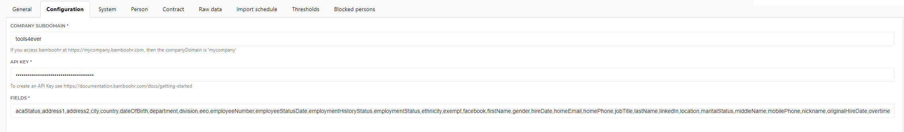

# Tools4everBV-HelloID-Conn-Prov-Source-BambooHR
Source data from BambooHR via API

## Table of contents

* [Introduction](#introduction)
* [Prerequisites](#prerequisites)
* [Mappings](#mappings)
* [Setup the PowerShell source connector](#setup-the-powershell-source-connector)

## Introduction

This source connector leverages the BambooHR API to import employees into HelloID Provisioning

## Prerequisites

- API Key from BambooHR

## Mappings

A basic person and contract mapping is provided. Make sure to further customize these accordingly.

## Setup the PowerShell source connector

1. Add a new 'Source System' to HelloID and make sure to import all the necessary files.

    - [ ] configuration.json
    - [ ] personMapping.json
    - [ ] contractMapping.json
    - [ ] persons.ps1
    - [ ] departments.ps1

2. Fill in the required fields on the connectors 'Configuration' tab.

